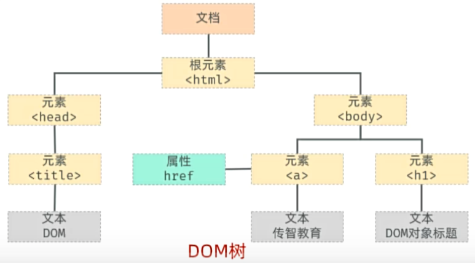

## JavaScript 学习笔记
创建时间：2025年6月

组成：
- ECMAScript：核心语言规范
- DOM：文档对象模型，操作 HTML 和 XML 文档的接口
- BOM：浏览器对象模型，提供浏览器相关的功能

### JS引入方式

- 内部脚本：将JS代码定义在HTML中
    + JS代码必须再有`<script>`标签中
    + 再HTML文档中，可以在任意地方，放置任意数量的`<script>`标签
    + 一般会放在`<body>`的底部，可以改善页面加载速度
    ```html
    <body><!-- 页面内容 -->
        <script>
            // JS代码
            alert("Hello, World!");
        </script>
    </body>
    
    ```
- 外部脚本：将JS代码放在单独的文件中
    + 使用`<script>`标签的`src`属性来指定外部脚本
    ```html
    <!-- 引用外部JS文件 -->
    <script src="../js/01.js"></script>
    ```

**注意事项：**
- 内部脚本和外部脚本可以同时使用
- 外部脚本便于代码复用和维护
- 建议将`<script>`标签放在`<body>`标签的底部，以确保页面内容先加载

### 基础语法

JavaScript 是一种弱类型语言，变量可以在运行时改变类型。

#### 变量声明 
使用`var`、`let` 或 `const` 关键字来声明变量：
```javascript
let name = "Alice"; // 字符串
let age = 30; // 数字
var isStudent = true; // 布尔值
// var的作用域是函数级别的，let和const是块级作用域 而且可重复声明变量 现在不推荐使用var
const PI = 3.14; // 常量
```

变量名规则：
- 只能包含字母、数字、下划线（_）和美元符号（$），且不能以数字开头
- 严格区分大小写
- 不能使用 JavaScript 的保留字（如 `if`、`else`、`function` 等）

#### 输出方式：
1. 使用 `console.log()` 输出到控制台
2. 使用 `alert()` 弹出对话框
3. 使用 `document.write()` 在页面上输出内容（不推荐）

#### 数据类型
JavaScript 有以下几种基本数据类型：

- number：数字类型，包括整数和浮点数
- string：字符串类型，用于表示文本
- boolean：布尔类型，表示真（true）或假（false）
- null：表示空值或无效值
- undefined：表示未定义的值

使用`typeof` 操作符可以检查变量的数据类型

**实际应用示例：**
```javascript
alert(typeof 10);        // number
alert(typeof 10.5);      // number
alert(typeof "Hello");   // string
alert(typeof 'World');   // string
alert(typeof `Template String`); // string
alert(typeof true);      // boolean
alert(typeof null);      // object (JavaScript的历史遗留问题)
alert(typeof undefined); // undefined
```

**注意：** `typeof null` 返回 "object" 是JavaScript的一个历史bug，但为了向后兼容一直保留。

模板字符串（Template Strings）：
使用反引号（``）包裹字符串，可以在字符串中嵌入变量和表达式
```javascript
let name = "Alice";
let greeting = `Hello, ${name}!`; // 使用模板字符串
alert(greeting); // 输出: Hello, Alice!
```

#### 函数
函数是 JavaScript 中的基本构建块，用于封装可重用的代码块。
具名函数
```javascript
function 函数名(参数1, 参数2) {
    // 函数体
    return 返回值; // 可选
}
```
函数在调用时参数数量可以与定义时不同，JavaScript 会忽略多余的参数，并将未提供的参数设置为 `undefined`。

匿名函数：
函数表达式
```javascript
let 函数名 = function(参数1, 参数2) {
    // 函数体
    return 返回值; // 可选
};
```
箭头函数（ES6 引入）：
```javascript
let 函数名 = (参数1, 参数2) => {
    // 函数体
    return 返回值; // 可选
};
```

**实际示例：**
```javascript
// 定义一个具名函数
function greet(name) {
    return `Hello, ${name}!`;
}
alert(greet("Alice")); // 输出: Hello, Alice!

// 函数表达式
let sum = function(a, b) {
    return a + b;
};
alert(sum(5, 10)); // 输出: 15

// 箭头函数（简洁语法）
let sub = (x, y) => x - y;
alert(sub(20, 5)); // 输出: 15
```
#### 自定义对象

定义格式
```javascript
let 对象名 = {
    属性1: 值1,
    属性2: 值2,
    方法1: function() {
        // 方法体
    },
    方法2() {
        // 方法体
    },
    sing:() => {
            alert(this); //在箭头函数中this代表父级对象 //尽量不要使用
        }
};
```

**实际示例：**
```javascript
let user = {
    name: "TOM",
    age: 17,
    say() {
        alert(`My name is ${this.name}, I am ${this.age}`);
    },
    sing: () => {
        alert(this); // 在箭头函数中this代表父级对象
    }
};

user.say();  // 调用普通方法，this指向user对象
user.sing(); // 调用箭头函数方法
```

**注意：** 在对象方法中，尽量使用普通函数而不是箭头函数，因为箭头函数的`this`指向会有所不同。

#### JSON（JavaScript Object Notation）
JSON 是一种轻量级的数据交换格式，易于阅读和编写。它基于 JavaScript 对象表示法，但可以在其他编程语言中使用。
JSON 格式：
```json
{
    "name": "Alice",
    "age": 30,
    "isStudent": true,
    "courses": ["Math", "Science"],
    "address": {
        "city": "New York",
        "zip": "10001"
    }
}
```

`JSON.parse()`：将 JSON 字符串转换为 JavaScript 对象
`JSON.stringify()`：将 JavaScript 对象转换为 JSON 字符串

**实际示例：**
```javascript
// JSON字符串转换为JavaScript对象
let jsonString = '{"name": "TOM","age": 17}';
let userObj = JSON.parse(jsonString);
alert(`My name is ${userObj.name}, I am ${userObj.age}`);

// JavaScript对象转换为JSON字符串
let user = {name: "TOM", age: 17};
let jsonResult = JSON.stringify(user);
document.write(jsonResult); // 输出: {"name":"TOM","age":17}
```
### DOM（文档对象模型）
DOM 是浏览器提供的 API，用于操作 HTML 和 XML 文档。它将文档表示为一个树状结构，每个节点都是一个对象。

**DOM 节点类型：**
- Document：表示整个 HTML 文档
- Element：表示 HTML 元素
- Attribute：表示 HTML 元素的属性
- Text：表示 HTML 元素中的文本内容
- Comment：表示 HTML 注释
- Node：DOM 中的基本单位，可以是元素、文本或注释



#### 获取DOM元素
使用CSS选择器可以获取元素：
```javascript
let element = document.querySelector("#myElement");    // 获取id为myElement的第一个元素
let elements = document.querySelectorAll(".myClass"); // 获取所有class为myClass的元素，返回NodeList
```

**NodeList特点：**
- 是一个伪数组（类数组对象）
- 可以使用 `forEach` 遍历
- 不能使用数组方法如 `map`、`filter` 等
- 可以通过索引访问元素：`elements[0]`

#### 操作DOM元素
```javascript
// 修改元素内容
let h1 = document.querySelector("#node1");
h1.innerHTML = "修改后的内容";

// 批量修改元素
let h2List = document.querySelectorAll(".hello");
h2List[0].innerHTML = "2qqq";
h2List[1].innerHTML = "3www";
```

**实际示例：**
```html
<h1 id="node1">1111</h1>
<h2 class="hello">2222</h2>
<h2 class="hello">3333</h2>

<script>
    let h1 = document.querySelector("#node1");
    let h2 = document.querySelectorAll(".hello");

    h1.innerHTML = "修改后的内容";
    h2[0].innerHTML = "2qqq";
    h2[1].innerHTML = "3www";
</script>
```

### 事件监听

- 语法`事件源.addEventListener('事件类型', 处理函数);`
- 远古写法`事件源.on事件类型 = 处理函数;`
- 区别：`addEventListener` 可以添加多个事件处理函数，而 `on` 只能有一个。(因为是对象的属性赋值)
- 三要素
  - 事件源：触发事件的元素
  - 事件类型：如 `click`、`mouseover` 等
  - 处理函数：当事件发生时执行的函数
常见事件:
<!-- 鼠标事件、键盘事件、表单事件、焦点事件生成一个表格 -->
|鼠标事件|键盘事件|焦点事件|表单事件|
|---|---|---|---|
|click|keydown|focus|submit|
|mouseenter|keyup|blur|change|
|mouseleave|keypress| |input|

### 模块化JS
JavaScript 模块化是将代码分割成独立的模块，以便于管理和复用。ES6 引入了模块化语法。
#### 模块导出
使用 `export` 关键字导出模块中的变量、函数或类：
```javascript
// 导出变量
export const PI = 3.14;
// 导出函数
export function add(a, b) {
    return a + b;
}
// 导出类
export class Person {
    constructor(name) {
        this.name = name;
    }
    greet() {
        console.log(`Hello, my name is ${this.name}`);
    }
}
```
#### 模块导入
使用 `import` 关键字导入模块中的内容：
```javascript
import { PI, add, Person } from './module.js';

console.log(PI); // 输出: 3.14
console.log(add(5, 10)); // 输出: 15

let user = new Person('Alice');
user.greet(); // 输出: Hello, my name is Alice
```
#### 标签中声明

```html
<script type="module">
    import { PI, add, Person } from './module.js';

    console.log(PI); // 输出: 3.14
    console.log(add(5, 10)); // 输出: 15

    let user = new Person('Alice');
    user.greet(); // 输出: Hello, my name is Alice
</script>