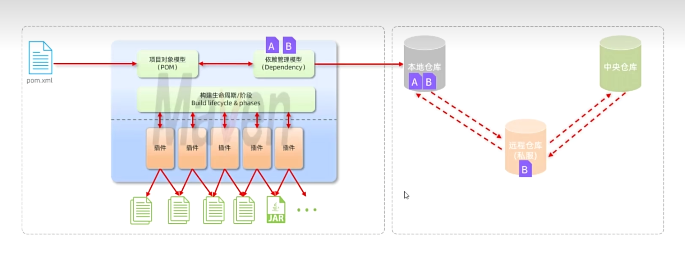

## Maven

创建时间：2025年7月8日

### Maven简介
Maven是一个项目管理工具，主要用于Java项目的构建、依赖管理和项目生命周期管理。它使用XML文件（`pom.xml`）来描述项目的结构、依赖关系和构建过程。

### Maven的作用

1. **依赖管理**：自动下载和管理项目所需的库和框架。
2. **项目构建**：提供标准化的构建过程，包括编译、测试、打包、发布等。
3. **统一项目结构**：提供一致的项目目录结构，便于团队协作和项目维护。



### Maven的坐标

- 什么是坐标：Maven使用坐标来唯一标识一个项目或库。坐标包括以下几个部分：
  - **groupId**：组织或公司标识符，通常是反向域名。
  - **artifactId**：项目或库的名称。
  - **version**：版本号，遵循语义化版本控制。
  - **packaging**：打包类型，如`jar`、`war`等。

### 依赖管理

#### 依赖配置

在`pom.xml`中配置依赖，示例如下：

```xml
<dependencies>
    <dependency>
        <groupId>com.example</groupId>
        <artifactId>my-library</artifactId>
        <version>1.0.0</version>
    </dependency>
</dependencies>
```

依赖传递：Maven会自动处理依赖的传递性，即如果A依赖B，B又依赖C，那么A也会自动获取C。

排除依赖：可以在依赖配置中排除不需要的传递依赖，示例如下：

```xml
<dependency>
    <groupId>com.example</groupId>
    <artifactId>my-library</artifactId>
    <version>1.0.0</version>
    <exclusions>
        <exclusion>
            <groupId>com.example</groupId>
            <artifactId>unwanted-library</artifactId>
        </exclusion>
    </exclusions>
</dependency>
```

### Maven生命周期

作用：Maven定义了一个标准的项目生命周期，包含多个阶段，每个阶段执行特定的任务。主要生命周期包括：
- **clean**：清理项目，删除生成的文件。
    + pre-clean：在清理之前执行的操作。
    + **clean**：执行清理操作。
    + post-clean：在清理之后执行的操作。
- **default**：默认生命周期，包含编译、测试、打包等阶段。
    + validate：验证项目是否正确。
    + **compile**：编译源代码。
    + **test**：运行测试代码。
    + **package**：打包编译后的代码。
    + verify：验证打包结果。
    + **install**：将包安装到本地仓库。
    + deploy：将包部署到远程仓库。
- **site**：生成项目文档。
    + pre-site：在生成文档之前执行的操作。
    + site：生成项目文档。
    + post-site：在生成文档之后执行的操作。
    + site-deploy：将生成的文档部署到服务器。

同一生命周期中，阶段是有顺序的，执行一个阶段会自动执行之前的所有阶段。例如，执行`package`会自动执行`compile`和`test`。

### 单元测试

测试阶段划分

- **单元测试**：测试单个类或方法的功能，通常使用JUnit框架。最小的测试单元。测试人员：开发者。
- **集成测试**：测试多个组件或模块之间的交互。测试人员：开发者。
- **系统测试**：测试整个系统的功能和性能，通常在部署环境中进行。测试人员：测试团队。
- **验收测试**：验证系统是否满足业务需求，通常由用户进行。测试人员：用户。

测试方法

- **黑盒测试**：关注输入和输出，不考虑内部实现。适用于所有测试阶段。
- **白盒测试**：关注内部逻辑和结构，通常用于单元测试。
- **灰盒测试**：结合黑盒和白盒测试，部分了解内部实现。适用于集成测试和系统测试。

    |单元测试|集成测试|系统测试|验收测试|
    |---|---|---|---|
    |白盒测试|灰盒测试|黑盒测试|黑盒测试|

单元测试：
- 使用JUnit框架编写测试类和测试方法。